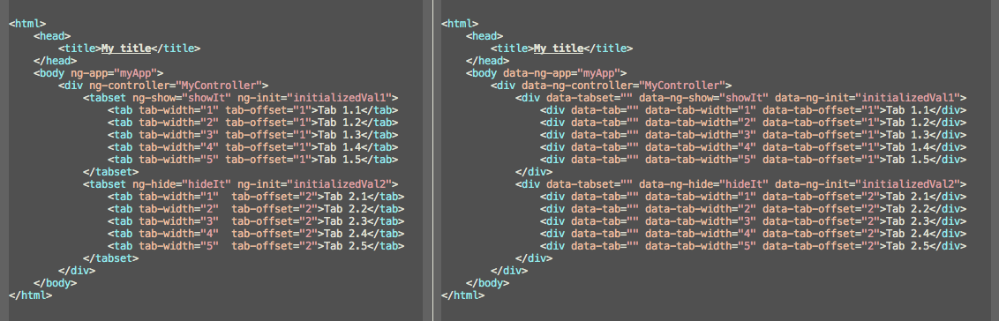

# grunt-nghtml-uglify [](http://travis-ci.org/narzac/grunt-nghtml-uglify)

> Grunt task for [nghtml-uglify](https://github.com/narzac/nghtml-uglify/)

* Issues with the output should be reported to
  [issue tracker](https://github.com/narzac/nghtml-uglify/issues).



## Getting Started

If you haven't used [grunt](http://gruntjs.com/) before, be sure to check out the
[Getting Started](http://gruntjs.com/getting-started) guide,
as it explains how to create a [gruntfile](http://gruntjs.com/sample-gruntfile)
as well as install and use grunt plugins. Once you're familiar with that process,
install this plugin with this command:

```bash
$ npm install --save-dev grunt-nghtml-uglify
```

Once the plugin has been installed, it may be enabled inside your Gruntfile with
this line of JavaScript:


```js
grunt.loadNpmTasks('grunt-nghtml-uglify');
```

*Tip: the [grunt-nghtml-uglify](https://github.com/nazrac/grunt-nghtml-uglify)
module makes  it possible to keep the
source code beatiful with custom angular directives, without worrying about HTML5
validation and old IE browser issues.*

## Documentation

See the grunt [docs](https://github.com/gruntjs/grunt/wiki) on how to
[configure tasks](https://github.com/gruntjs/grunt/wiki/Configuring-tasks)
 and more advanced usage.

### Example with custom config and rules

```js
 grunt.initConfig({
     nghtmlUglify: {
         options: {
             directives: 'configs/directives.json'
         },
         dev: {
             files: [{
                 expand: true,
                 cwd: 'tests/',
                 src: ['*.html'],
                 dest: 'tmp/',
                 ext: '.ng.html',
                 extDot: 'first'
             }]
         }
     }
});

grunt.loadNpmTasks('grunt-nghtml-uglify');
grunt.registerTask('default', ['nghtmlUglify']);
```

### Examples

Please see [Gruntfile](https://github.com/narzac/grunt-nghtml-uglify/blob/master/Gruntfile.js)
as an example usage

### Options


#### prefix

Type: `String`
Default: 'data-'

This config exist in case of a possible XHTML support in future release, you may safelyskip it
if you are already using HTML5.

#### directives

Type: `String`
Default: ''

* Note that you should provide one, see an
[example](https://github.com/narzac/grunt-nghtml-uglify/blob/master/configs/directives.json)

Path to a json file which contains the angular and custom directives that are being used.
In future, we may parse javascript and get the directives automatically. Yet for the time being
adduming you use grunt-html-validation, you will know which directives to add to the directives.json


## License

MIT © [Ahmet Yeşil](http://narzac.me)
